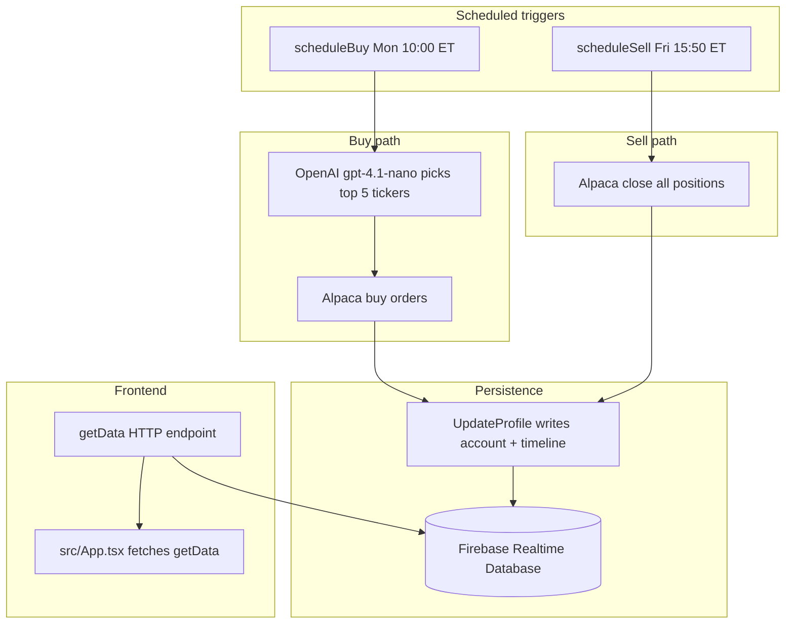

# AGENTS.md — algosus

Stock trading bot for educational purposes. React dashboard + Firebase Cloud Functions backend with OpenAI stock picks and Alpaca paper trading.

## Two-package layout

| Package | Path | Purpose |
|---|---|---|
| Frontend | `src/`, root `package.json` | Vite + React UI (D3 graph, MUI table) |
| Backend | `functions/src/`, `functions/package.json` | Firebase Cloud Functions (trading, schedules, data API) |

## Stack (Phase 1 — Jul 2026)

| Layer | Versions |
|---|---|
| TypeScript | 5.8.x (root + functions) |
| React | 19.x |
| MUI | 6.x (`@mui/x-data-grid` 7.x) |
| Build | Vite 6.x |
| Backend | Node 22, `firebase-functions` 6.x, `firebase-admin` 13.x, OpenAI SDK 4.x |

Local verification (no deploy): `npm run build`, `npm --prefix functions run build`, `npm --prefix functions run lint` — all must pass after dependency changes.

## Git workflow

- **Single branch:** All work happens on `main`. Do not create feature branches or worktrees unless the user explicitly requests isolation.
- **Remote:** `origin/main` is the only integration branch. Push directly to `main` after local verification.
- **Deploys:** Vercel auto-deploy is disabled (`vercel.json` → `git.deploymentEnabled: false`). Firebase functions deploy only when explicitly requested.

## Core scripts

**Frontend (repo root):**

```bash
npm run dev      # Vite dev server (port 3000)
npm run build    # tsc + vite build
npm run preview  # preview production build
```

**Backend (`functions/`):**

```bash
npm --prefix functions run build   # compile TypeScript to lib/
npm --prefix functions run serve   # emulator (functions only)
npm --prefix functions run deploy  # deploy to Firebase
npm --prefix functions run lint    # ESLint (functions only)
```

## Trading flow



1. **Buy (Monday 10:00 AM ET):** `scheduleBuy` calls OpenAI (`gpt-4.1-nano`) in `functions/src/buy.ts` for top 5 ticker symbols, then places Alpaca buy orders with available cash.
2. **Sell (Friday 3:50 PM ET):** `scheduleSell` in `functions/src/sell.ts` closes all Alpaca positions via REST API, then refreshes the profile.
3. **Profile update:** `UpdateProfile` in `functions/src/update.ts` writes account equity and positions to Firebase Realtime Database and appends a timeline entry.
4. **Data API:** `getData` in `functions/src/getData.ts` reads RTDB and may trigger `UpdateProfile` when data is stale (18h threshold, or 5 min during market hours).
5. **Frontend:** `src/App.tsx` fetches `getData` on load and renders `Graph.tsx` + `Table.tsx`.

## Cloud Functions

| Export | Type | File | Purpose |
|---|---|---|---|
| `getData` | HTTP | `functions/src/getData.ts` | Read portfolio data; auto-refresh when stale |
| `update` | HTTP | `functions/src/update.ts` | Manual profile refresh |
| `buy` | HTTP | `functions/src/buy.ts` | Manual buy trigger |
| `sell` | HTTP | `functions/src/sell.ts` | Manual sell trigger |
| `scheduleBuy` | Scheduler | `functions/src/buy.ts` | Cron: `0 10 * * 1` America/New_York |
| `scheduleSell` | Scheduler | `functions/src/sell.ts` | Cron: `50 15 * * 5` America/New_York |

All exports are registered in `functions/src/index.ts`.

## Frontend API URL

`src/App.tsx` hardcodes two URLs:

```typescript
const local = 'http://127.0.0.1:5001/algosus/us-central1/getData';
const production = 'https://us-central1-algosus.cloudfunctions.net/getData';
const url = production; // change to `local` when testing against the emulator
```

To test locally: start the functions emulator (`npm --prefix functions run serve`), set `url = local`, then run `npm run dev`.

## Key files

| Area | Files |
|---|---|
| Config / secrets | `functions/src/config.ts` |
| Data models | `functions/src/models.ts` |
| Trading logic | `functions/src/buy.ts`, `functions/src/sell.ts` |
| Data sync | `functions/src/update.ts`, `functions/src/getData.ts` |
| Entrypoint | `functions/src/index.ts` |
| UI | `src/App.tsx`, `src/Graph.tsx`, `src/Table.tsx` |
| Firebase project | `firebase.json`, `.firebaserc` (project: `algosus`) |

## Environment setup

See `functions/README.md` and `functions/.env.example`. Copy `.env.example` to `.env` in `functions/` before running locally.

## Project knowledge

- `docs/solutions/` — documented solutions to past problems (bugs, best practices, workflow patterns), organized by category with YAML frontmatter (`module`, `tags`, `problem_type`). Relevant when implementing or debugging in documented areas.
- `CONCEPTS.md` — shared domain vocabulary (entities, named processes, status concepts). Relevant when orienting to the codebase or discussing trading flow terms.

## Out of scope without explicit request

- Changing trading prompts, schedules, or buy/sell logic
- Switching from Alpaca paper trading to live trading
- Adding tests or CI (dependency upgrades are allowed when requested; see Phase 1 plan in `docs/plans/`)
