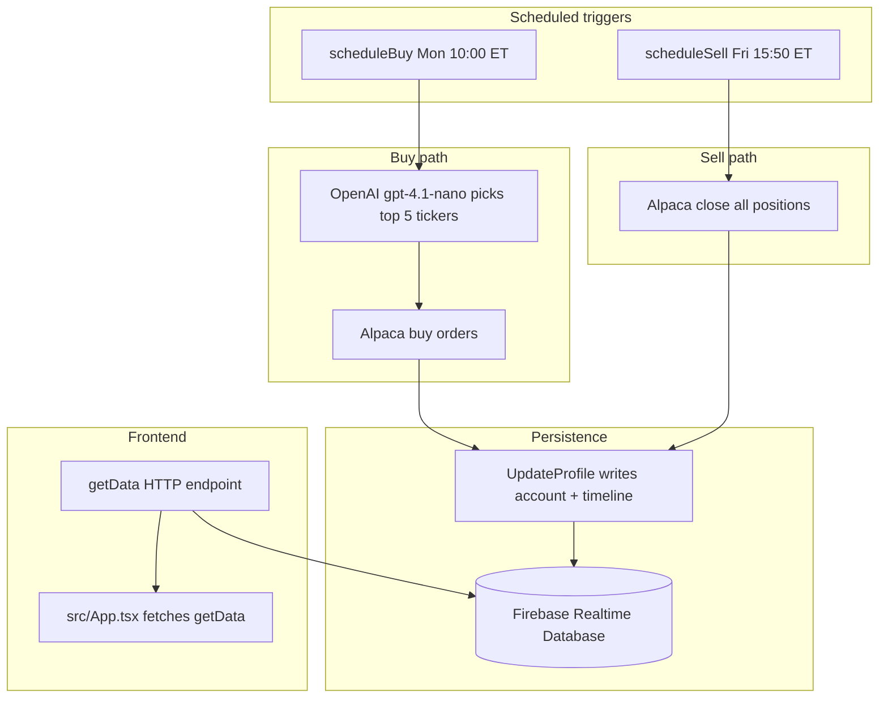

## Goal Capsule

- **Objective:** Establish clear AI agent documentation, Cursor rules, and targeted structural guidance for algosus so new AI coding sessions start warm without requiring manual context re-explanation.
- **Product Authority:** User alignment (session 2026-07-27).
- **Open Blockers:** None.

---

## Product Contract

**Product Contract preservation:** changed: R2 — codebase uses Firebase Realtime Database (`firebase/database`), not Firestore; wording corrected for agent accuracy.

### Summary

Add an architecture-first `AGENTS.md` and Cursor rules that embed the algosus trading flow, two-package architecture (Vite UI + Firebase Cloud Functions), and runtime constraints. Introduce minimal structural clarity (consistent export syntax, environment variable template) to prevent cold-start friction and unsafe edits.

### Problem Frame

The algosus codebase was built as a trading bot using React/TypeScript on the frontend and Firebase Cloud Functions (integrating OpenAI gpt-4.1-nano and Alpaca APIs) on the backend. Because the repository lacks agent configuration files (`.cursor/rules` or `AGENTS.md`), test suites, or root-level linting, every new AI coding session starts cold. Developers currently spend significant time re-explaining how the automated buy/sell schedules operate, how data flows from Firebase to the frontend, and which environment variables and deploy endpoints are required.

### Key Decisions

- **Embedded agent rules over external hops:** Embed the complete trading flow diagram and key file paths directly inside agent context files (`AGENTS.md` and `.cursor/rules/`) so AI models receive necessary context on their first turn rather than following secondary links. (session-settled: user-directed — chosen over separate architecture docs only: embedded rules give context immediately on cold start)
- **Docs and light structure over full tooling refresh:** Prioritize agent documentation, entrypoint consistency, and environment templates over adding comprehensive unit tests, CI pipelines, or major dependency upgrades. (session-settled: user-approved — chosen over full tooling overhaul: targets the primary friction of re-explaining the codebase while keeping code churn low)
- **Scope bounded to docs and light structural tweaks:** Limit changes to documentation and minor code clarity improvements (such as standardized function exports in `functions/src/index.ts` and env templates). (session-settled: user-directed — chosen over broader folder reorganizations: preserves existing working code while clarifying boundaries)

### Requirements

#### Agent Onboarding Documentation

- R1. Create an `AGENTS.md` file at the repository root outlining the project purpose, two-package structure (`src/` Vite React app and `functions/` Firebase Cloud Functions), and core scripts.
- R2. Document the complete trading flow in `AGENTS.md`, explicitly detailing:
  - OpenAI stock selection (`functions/src/buy.ts` calling gpt-4.1-nano)
  - Alpaca order execution (`functions/src/buy.ts` and `functions/src/sell.ts`)
  - Firebase Realtime Database profile updates (`functions/src/update.ts`)
  - Scheduled function triggers (Monday 10:00 AM buy schedule via `scheduleBuy`, Friday 3:50 PM sell schedule via `scheduleSell`)
  - Frontend portfolio data fetching (`src/App.tsx` calling `getData`)
- R3. Create Cursor rules under `.cursor/rules/` for key topics (architecture, backend functions, and safety constraints) to automatically guide AI agent behavior in Cursor sessions.
- R4. Add a `functions/README.md` file detailing backend environment variable dependencies, Cloud Function trigger schedules, and local emulator setup using `npm --prefix functions run serve`.

#### Repository Structure & Configuration Guidance

- R5. Standardize export declarations in `functions/src/index.ts` to use consistent TypeScript export syntax across all HTTP endpoints (`getData`, `update`, `buy`, `sell`) and scheduled triggers (`scheduleBuy`, `scheduleSell`).
- R6. Create a `functions/.env.example` template listing required environment keys (`OPENAI_API_KEY`, `ALPACA_API_KEY`, `ALPACA_SECRET_KEY`) with paper trading defaults and clear safety notes.
- R7. Document API endpoint configuration in agent context, noting the difference between local emulator (`http://127.0.0.1:5001/...`) and production Cloud Function URLs (`https://us-central1-algosus.cloudfunctions.net/...`) in `src/App.tsx`.

### Scope Boundaries

#### In Scope

- Creation of `AGENTS.md` at repository root.
- Creation of `.cursor/rules/` rulesets for architecture, backend functions, and safety constraints.
- Creation of `functions/README.md` and `functions/.env.example`.
- Standardized export syntax in `functions/src/index.ts`.
- Documentation of local vs production API URL configuration in `src/App.tsx`.

#### Out of Scope / Deferred

- Adding automated test suites (Jest/Vitest/`firebase-functions-test`).
- Setting up GitHub Actions CI/CD workflows.
- Major dependency or Node.js runtime upgrades.
- Adding root-level ESLint or Prettier linter configurations.
- Modifications to stock trading logic or ChatGPT prompt strategies.

#### Deferred to Follow-Up Work

- Extract `src/App.tsx` API URL to `VITE_API_URL` (or similar) so local vs production switching does not require editing source.

### Sources / Research

- Grounding dossier from brainstorm session (repo scan 2026-07-27).
- Key code entrypoints inspected: `functions/src/index.ts`, `functions/src/config.ts`, `functions/src/buy.ts`, `functions/src/sell.ts`, `functions/src/getData.ts`, `functions/src/update.ts`, `src/App.tsx`, `firebase.json`.

---

## Planning Contract

### Key Technical Decisions

- **KTD1 — Embed context in agent artifacts, not separate architecture docs.** `AGENTS.md` and `.cursor/rules/` carry the trading flow, file map, and constraints inline. (session-settled: user-directed — chosen over separate architecture docs only: embedded rules give context immediately on cold start)
- **KTD2 — Document App.tsx URL switching; defer env extraction.** R7 is satisfied by agent docs describing the hardcoded `local` / `production` constants in `src/App.tsx`. No `VITE_*` env extraction in this pass. User confirmed document-only now; `VITE_API_URL` extraction deferred to a follow-up.
- **KTD3 — Unify `functions/src/index.ts` on `export const`.** Replace `exports.scheduleBuy` / `exports.scheduleSell` with `export const scheduleBuy` / `export const scheduleSell` to match the HTTP function exports. Firebase Functions v2 re-exports work the same way.
- **KTD4 — Three focused Cursor rule files.** Split rules by concern (`architecture.mdc`, `backend-functions.mdc`, `safety.mdc`) rather than one monolithic rule file, so Cursor can apply context by file glob without loading the full doc every turn.

- **KTD5 — `.env.example` lists all five runtime keys.** Include `OPENAI_API_KEY`, `ALPACA_API_KEY`, `ALPACA_SECRET_KEY`, `FB_API_KEY`, and `FB_DB_URL` in `functions/.env.example`. R6's three keys are the minimum trading-API set; Firebase vars are required for `config.ts` to initialize and agents miss them if only documented in README.

### High-Level Technical Design

**Two-package layout**

| Package | Path | Role |
|---|---|---|
| Frontend | `src/`, root `package.json` | Vite + React dashboard; fetches portfolio via `getData` |
| Backend | `functions/src/`, `functions/package.json` | Firebase Cloud Functions; trading logic, schedules, Firebase RTDB |

**Trading flow (end-to-end)**

**Function inventory**

| Export | Type | File | Purpose |
|---|---|---|---|
| `getData` | HTTP | `functions/src/getData.ts` | Read RTDB; auto-refresh profile when stale |
| `update` | HTTP | `functions/src/update.ts` | Manual profile refresh |
| `buy` | HTTP | `functions/src/buy.ts` | Manual buy trigger |
| `sell` | HTTP | `functions/src/sell.ts` | Manual sell trigger |
| `scheduleBuy` | Scheduler | `functions/src/buy.ts` | Cron: `0 10 * * 1` America/New_York |
| `scheduleSell` | Scheduler | `functions/src/sell.ts` | Cron: `50 15 * * 5` America/New_York |

**Environment variables**

| Variable | Used in | Notes |
|---|---|---|
| `OPENAI_API_KEY` | `functions/src/config.ts` | ChatGPT stock picks |
| `ALPACA_API_KEY` | `functions/src/config.ts`, `sell.ts` | Paper trading (`paper: true` in config) |
| `ALPACA_SECRET_KEY` | `functions/src/config.ts`, `sell.ts` | Paper trading |
| `FB_API_KEY` | `functions/src/config.ts` | Firebase client init (document in `functions/README.md`, not R6 template) |
| `FB_DB_URL` | `functions/src/config.ts` | Realtime Database URL (document in `functions/README.md`) |

---

## Implementation Units

### U1. Root agent guide (`AGENTS.md`)

- **Goal:** Give every new AI session a single entry point with architecture, scripts, trading flow, and file map.
- **Requirements:** R1, R2, R7
- **Dependencies:** None
- **Files:** `AGENTS.md` (create)
- **Approach:** Structure as scannable sections: Project overview, Two-package layout, Core scripts (`npm run dev`, `npm --prefix functions run build`, `npm --prefix functions run serve`, `npm --prefix functions run deploy`), Trading flow (embed the mermaid diagram from Planning Contract or equivalent prose), Function inventory table, Frontend data fetch (`src/App.tsx` hardcodes `production` URL — document how to switch to `local` for emulator testing), Key files map (`buy.ts`, `sell.ts`, `update.ts`, `getData.ts`, `config.ts`, `models.ts`, `App.tsx`, `Graph.tsx`, `Table.tsx`), Out-of-scope reminders (no trading logic changes without explicit ask).
- **Patterns to follow:** Tone and facts from root `README.md`; technical detail from `functions/src/*` entrypoints.
- **Test expectation:** none — documentation-only unit.
- **Verification:** File exists; trading flow mentions all six exports; local vs production URL guidance matches `src/App.tsx` lines 25–27.

### U2. Backend README and env template

- **Goal:** Document backend setup, schedules, and secrets for agents and humans working in `functions/`.
- **Requirements:** R4, R6
- **Dependencies:** None (can run parallel to U1)
- **Files:** `functions/README.md` (create), `functions/.env.example` (create)
- **Approach:** README covers: purpose, required env vars (all five from config), copy `.env.example` to `.env`, emulator command (`npm run serve`), deploy command (`npm run deploy`), schedule table (buy Monday 10:00 ET, sell Friday 3:50 PM ET), function list with HTTP vs scheduler type. `.env.example` lists all five runtime keys per KTD5 with placeholder values and comments noting paper trading and that real keys must not be committed.
- **Patterns to follow:** Existing `functions/package.json` scripts; `functions/src/config.ts` for env var names.
- **Test expectation:** none — documentation-only unit.
- **Verification:** `.env.example` contains all five runtime keys (`OPENAI_API_KEY`, `ALPACA_API_KEY`, `ALPACA_SECRET_KEY`, `FB_API_KEY`, `FB_DB_URL`); README documents each var's purpose.

### U3. Cursor rules

- **Goal:** Auto-inject scoped context when agents edit frontend, backend, or sensitive areas.
- **Requirements:** R3, R2, R7
- **Dependencies:** U1 (content can be distilled from `AGENTS.md` draft)
- **Files:** `.cursor/rules/architecture.mdc` (create), `.cursor/rules/backend-functions.mdc` (create), `.cursor/rules/safety.mdc` (create)
- **Approach:**
  - `architecture.mdc` — globs: `**/*`; alwaysApply or broad glob. Two-package map, trading flow summary, key scripts.
  - `backend-functions.mdc` — globs: `functions/**/*`. Function roles, schedules, env vars, `config.ts` as secrets entry point.
  - `safety.mdc` — globs: `functions/**/*`, `src/**/*`. Do not commit `.env`; Alpaca is paper-only; do not change trading prompts or schedules without explicit request; production URL default in `App.tsx`.
- **Patterns to follow:** Cursor `.mdc` format with `description`, `globs`, and markdown body.
- **Test expectation:** none — configuration-only unit.
- **Verification:** Three rule files exist with non-empty bodies and appropriate globs.

### U4. Export consistency in functions entrypoint

- **Goal:** Remove mixed `export const` / `exports.` style in the Firebase entrypoint.
- **Requirements:** R5
- **Dependencies:** None
- **Files:** `functions/src/index.ts` (modify)
- **Approach:** Change lines 13–14 from `exports.scheduleBuy = ScheduleBuy` to `export const scheduleBuy = ScheduleBuy` (and same for `scheduleSell`). No other logic changes.
- **Patterns to follow:** Existing `export const` lines 7–10 in the same file.
- **Execution note:** This is a one-line-per-export syntax change; prefer `npm --prefix functions run build` smoke verification over unit tests.
- **Test expectation:** none — syntax-only change with no behavioral delta.
- **Verification:** `npm --prefix functions run build` succeeds; `npm --prefix functions run lint` passes.

---

## Verification Contract

| Gate | Command | Applies to |
|---|---|---|
| Frontend build | `npm run build` | U1–U3 (no frontend code changes; confirms repo still healthy) |
| Functions build | `npm --prefix functions run build` | U4 |
| Functions lint | `npm --prefix functions run lint` | U4 |
| Doc completeness | Manual review of `AGENTS.md`, `.cursor/rules/*`, `functions/README.md`, `functions/.env.example` | U1–U3 |

---

## Definition of Done

- [ ] `AGENTS.md` exists with two-package overview, scripts, trading flow, function inventory, and App.tsx URL guidance (R1, R2, R7).
- [ ] `functions/README.md` and `functions/.env.example` exist with env and schedule documentation (R4, R6).
- [ ] Three Cursor rule files exist under `.cursor/rules/` (R3).
- [ ] `functions/src/index.ts` uses consistent `export const` for all six exports (R5).
- [ ] All Verification Contract gates pass.
- [ ] No trading logic, dependency upgrades, tests, or CI added (scope boundaries honored).
