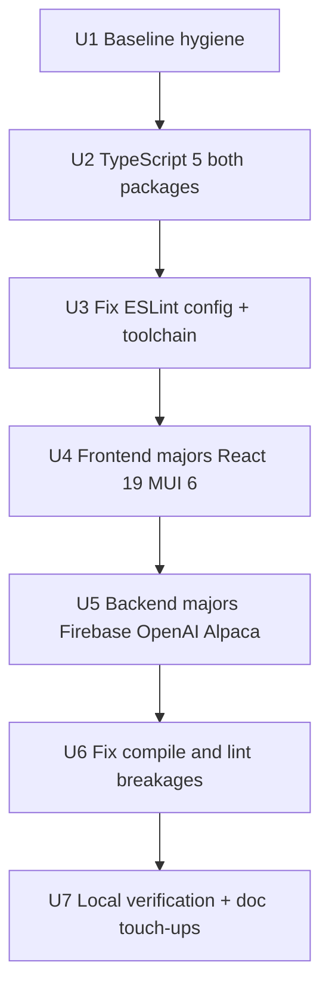

## Goal Capsule

- **Objective:** Upgrade algosus to current major dependency versions (TypeScript 5, React 19, MUI 6, current Firebase/OpenAI stack), fix broken functions ESLint, and leave both packages building and linting clean — verified locally only.
- **Product Authority:** User alignment (session 2026-07-27).
- **Open Blockers:** None (work consolidated on `main`; Vercel git deploy disabled).

---

## Product Contract

**Product Contract preservation:** new artifact (no prior requirements doc for modernization).

### Summary

Phase 1 of a balanced phased modernization: dependency and toolchain upgrades first, using latest majors where reasonable, with local build/lint verification as the completion bar. Tooling polish (Prettier, tests, CI, `VITE_API_URL`) and production deploys are deferred to later phases.

### Problem Frame

algosus runs on dated stacks (TypeScript 4.9, React 18, MUI 5, ESLint 8 with a broken `functions/.eslintrc.js` config). Agent onboarding improved discoverability but explicitly deferred dependency upgrades, CI, and tests. The user now wants a modern codebase aligned with current ecosystem practices while keeping deploy control local until they approve.

### Key Decisions

- **Balanced phased refresh over big-bang everything:** Modernize in phases; Phase 1 is dependencies only. (session-settled: user-directed — chosen over single-surface or tooling-first approaches: spreads risk while still reaching current versions)
- **Phase 1 = dependencies first:** Bump packages before adding Prettier, tests, or CI. (session-settled: user-directed — chosen over foundation-first or tests-first: user priority is current versions)
- **Latest majors where reasonable:** Target React 19, MUI 6, TypeScript 5, current Firebase Functions and OpenAI SDK majors. (session-settled: user-directed — chosen over staying on React 18 / MUI 5 minors)
- **Phase 1 done = build + lint:** Both `npm run build` and `npm --prefix functions run lint` must pass. (session-settled: user-directed — chosen over build-only or adding tests in Phase 1)
- **Local verification only:** No Vercel or Firebase deploy in Phase 1; user approves deploy separately. (session-settled: user-approved — chosen over CI-gated auto-deploy)
- **Trading logic refactors allowed when required:** Upgrade breakages may change implementation; strategy changes are not a Phase 1 goal. (session-settled: user-approved — chosen over strict behavior freeze)

### Requirements

#### Phase 1 — Dependency & Toolchain Upgrades

- R1. Upgrade TypeScript to 5.x in both root `package.json` and `functions/package.json`, updating `tsconfig.json` / `functions/tsconfig.json` only as needed for compatibility.
- R2. Upgrade frontend runtime dependencies to current majors: React 19, React DOM 19, MUI 6 (`@mui/material`, `@mui/icons-material`, `@mui/x-data-grid`), and compatible Emotion packages.
- R3. Upgrade frontend build tooling: Vite (already 6.x), `@vitejs/plugin-react-swc`, and `@types/react` / `@types/react-dom` for React 19.
- R4. Upgrade backend dependencies to current compatible majors: `firebase-functions`, `firebase-admin`, `firebase`, `openai`, `@alpacahq/alpaca-trade-api`, and `dotenv`.
- R5. Fix `functions/.eslintrc.js` so ESLint loads correctly (convert from invalid ESM `export const` to CommonJS `module.exports`, or migrate to flat config — choose the smallest fix that works with ESLint 9 if upgraded).
- R6. Upgrade functions ESLint toolchain (`eslint`, `@typescript-eslint/*`, plugins) to versions compatible with TypeScript 5 and Node 22.
- R7. Resolve all TypeScript compile errors in `src/` and `functions/src/` introduced by upgrades without disabling `strict` mode.
- R8. Resolve all ESLint errors in `functions/` after toolchain fix; warnings may remain only if pre-existing and documented in plan assumptions.

#### Phase 1 — Verification

- R9. `npm run build` at repo root completes successfully.
- R10. `npm --prefix functions run build` completes successfully.
- R11. `npm --prefix functions run lint` completes successfully (exit 0).
- R12. Document any manual local smoke steps performed (emulator start, `npm run dev`) in the PR or commit message; automated smoke scripts are not required in Phase 1.

#### Cross-cutting

- R13. Update `AGENTS.md` and `.cursor/rules/safety.mdc` if dependency or tooling changes invalidate prior "no upgrades" guidance.
- R14. Preserve paper trading (`paper: true` in `functions/src/config.ts`) and Firebase project `algosus` unless an upgrade forces explicit migration notes.

### Scope Boundaries

#### In Scope (Phase 1)

- Dependency version bumps in root and `functions/package.json`
- TypeScript and ESLint config fixes required for build/lint
- Source changes required solely to satisfy upgraded type definitions or breaking API changes
- Agent doc updates that contradict new reality (R13)

#### Deferred for Later Phases

- GitHub Actions / CI pipelines
- Vitest or integration test suite
- Prettier and root-level ESLint (unless required to unblock functions lint)
- `VITE_API_URL` and frontend env-based API configuration
- Production deploy to Vercel or Firebase
- README marketing copy refresh

#### Out of Scope

- Switching from paper to live Alpaca trading
- Changing buy/sell schedules or OpenAI prompts as standalone goals
- Migrating from Realtime Database to Firestore
- Replacing MUI/D3 chart implementation with a different UI framework

### Sources / Research

- Current manifests: `package.json`, `functions/package.json`
- Broken lint config: `functions/.eslintrc.js` (ESM exports invalid for ESLint 8 loader)
- Prior deferrals superseded: `docs/plans/2026-07-27-001-docs-agent-onboarding-plan.md` Scope Boundaries
- Agent context: `AGENTS.md`, `.cursor/rules/`

---

## Planning Contract

### Key Technical Decisions

- **KTD1 — Layered upgrade order within Phase 1.** Sequence: TypeScript 5 (both packages) → fix ESLint config/toolchain → frontend majors → backend majors → fix breakages. Reduces debugging ambiguity when multiple surfaces fail at once. (session-settled: user-directed — chosen over big-bang single PR: matches deps-first phased intent)
- **KTD2 — ESLint: minimal fix path first.** Convert `functions/.eslintrc.js` to valid CommonJS and bump `@typescript-eslint` to TS5-compatible versions before considering ESLint 9 flat config migration. Flat config is Phase 2 unless required. (session-settled: user-approved — chosen over full ESLint 9 migration in Phase 1: meets lint-pass bar with lower risk)
- **KTD3 — MUI 6 migration uses official codemods where available.** Run `@mui/codemod` for v5→v6 breaking changes before hand-fixing component APIs. (session-settled: user-approved — standard practice for major MUI bumps)
- **KTD4 — OpenAI SDK: migrate to current client patterns.** `openai` v4+ uses the Responses API in `buy.ts`; verify against latest SDK docs and adjust call shape only as required for compile/runtime. (session-settled: user-approved — upgrade necessity)
- **KTD5 — No deploy automation in Phase 1.** Verification is local builds + lint; optional manual emulator/dev-server smoke documented by implementer. (session-settled: user-approved — local-first deploy control)

### High-Level Technical Design

**Phase 1 upgrade sequence**

**Current vs target (Phase 1)**

| Area | Current | Target |
|---|---|---|
| TypeScript | 4.9.x (both) | 5.x (both) |
| React | 18.2 | 19.x |
| MUI | 5.11 / 5.14 / 5.17 | 6.x aligned |
| ESLint (functions) | 8.x, broken config | Working 8.x or 9.x with passing lint |
| firebase-functions | 6.0.1 | Latest 6.x compatible |
| openai | 4.96.0 | Latest 4.x/5.x per SDK compatibility |

**Risk hotspots**

| Surface | Risk | Mitigation |
|---|---|---|
| MUI 5→6 | Grid, theme, slot props | Codemods + visual check via `npm run dev` |
| React 19 | Types, ref callbacks | Update `@types/react`, fix strict errors |
| OpenAI SDK | API shape in `buy.ts` | Read SDK migration notes, emulator test buy path |
| ESLint config | Invalid module format | CommonJS fix before rule tuning |

---

## Implementation Units

### U1. Baseline hygiene

- **Goal:** Establish a clean starting point and record pre-upgrade versions.
- **Requirements:** R12
- **Dependencies:** None
- **Files:** `package-lock.json`, `functions/package-lock.json` (regenerated later), optional `docs/plans/` note in commit message
- **Approach:** Commit agent-onboarding and modernization work on `main` when ready. Record current `npm ls` versions for root and functions before bumps.
- **Test expectation:** none — process unit.
- **Verification:** Clean `git status` relative to chosen commit strategy; work is on `main`.

### U2. TypeScript 5 (both packages)

- **Goal:** Align both packages on TypeScript 5.x before application dependency majors.
- **Requirements:** R1, R7
- **Dependencies:** U1
- **Files:** `package.json`, `functions/package.json`, `tsconfig.json`, `functions/tsconfig.json`, `tsconfig.node.json`
- **Approach:** Bump `typescript` devDependency in root and functions. Set `moduleResolution` / `target` in functions tsconfig to modern Node 22 defaults if TS 5 recommends (`ES2022`+). Run `npm run build` and `npm --prefix functions run build`; fix any new strict errors.
- **Patterns to follow:** Keep `strict: true` in both tsconfigs.
- **Test expectation:** none — compiler gate is the check.
- **Verification:** Both build commands pass after TS-only bump (may require minor type fixes before later units).

### U3. Fix functions ESLint config and toolchain

- **Goal:** Make `npm --prefix functions run lint` runnable and TS5-aware.
- **Requirements:** R5, R6, R8, R11
- **Dependencies:** U2
- **Files:** `functions/.eslintrc.js`, `functions/package.json`, optionally `functions/eslint.config.js` if flat config chosen
- **Approach:** Replace ESM `export const` in `.eslintrc.js` with `module.exports = { ... }`. Upgrade `eslint`, `@typescript-eslint/eslint-plugin`, `@typescript-eslint/parser` to versions supporting TS 5. Run lint; fix config errors before source rule violations.
- **Patterns to follow:** Existing google + typescript-eslint extends list unless incompatible.
- **Test expectation:** none — lint command is the gate.
- **Verification:** `npm --prefix functions run lint` starts without config parse errors.

### U4. Frontend major dependency upgrades

- **Goal:** Upgrade React 19 and MUI 6 ecosystem packages.
- **Requirements:** R2, R3, R7
- **Dependencies:** U2
- **Files:** `package.json`, `package-lock.json`, `src/App.tsx`, `src/Graph.tsx`, `src/GraphHeader.tsx`, `src/Table.tsx`, `src/main.tsx`, MUI/D3-related components
- **Approach:** Bump `react`, `react-dom`, `@mui/material`, `@mui/icons-material`, `@mui/x-data-grid`, `@emotion/react`, `@emotion/styled`, `@types/react`, `@types/react-dom`, `@vitejs/plugin-react-swc`. Run MUI codemods. Fix Grid v2 props, theme provider changes, and React 19 type errors. Run `npm run build` until clean.
- **Execution note:** Prefer `npm run dev` visual smoke after MUI migration for layout regressions.
- **Test expectation:** none — build + manual smoke in Phase 1.
- **Verification:** `npm run build` passes; dev server loads dashboard without console errors (manual).

### U5. Backend major dependency upgrades

- **Goal:** Upgrade Firebase Functions stack and API clients.
- **Requirements:** R4, R7, R14
- **Dependencies:** U2, U3
- **Files:** `functions/package.json`, `functions/package-lock.json`, `functions/src/config.ts`, `functions/src/buy.ts`, `functions/src/sell.ts`, `functions/src/getData.ts`, `functions/src/update.ts`
- **Approach:** Bump `firebase-functions`, `firebase-admin`, `firebase`, `openai`, `@alpacahq/alpaca-trade-api`, `dotenv`. Follow Firebase Functions v2 and OpenAI SDK migration notes. Adjust imports and client initialization only as required. Keep `paper: true` and env var names stable.
- **Test expectation:** none — build + lint gates.
- **Verification:** `npm --prefix functions run build` passes.

### U6. Resolve remaining compile and lint violations

- **Goal:** Clear all Phase 1 breakages across both packages.
- **Requirements:** R7, R8, R9, R10, R11
- **Dependencies:** U4, U5
- **Files:** Any remaining `src/**` and `functions/src/**` files flagged by `tsc` or `eslint`
- **Approach:** Fix errors in dependency order. For trading logic changes forced by SDK upgrades, keep behavior equivalent (schedules, paper trading, RTDB paths) unless SDK removes an API — document any intentional behavior change in commit message.
- **Patterns to follow:** Existing function export pattern in `functions/src/index.ts`.
- **Test expectation:** none.
- **Verification:** All three verification commands pass.

### U7. Agent doc updates and Phase 1 sign-off

- **Goal:** Align agent guidance with post-upgrade reality and record local verification.
- **Requirements:** R12, R13
- **Dependencies:** U6
- **Files:** `AGENTS.md`, `.cursor/rules/safety.mdc`, optionally `functions/README.md`
- **Approach:** Remove or revise "no dependency upgrades" language in safety rule. Note TypeScript 5 / React 19 / MUI 6 in AGENTS.md stack section if present. Record manual smoke steps taken (build, lint, optional emulator/dev).
- **Test expectation:** none — documentation unit.
- **Verification:** Agent docs no longer contradict Phase 1 outcomes; Definition of Done checklist complete.

---

## Verification Contract

| Gate | Command | Applies to |
|---|---|---|
| Frontend build | `npm run build` | U4, U6 |
| Functions build | `npm --prefix functions run build` | U5, U6 |
| Functions lint | `npm --prefix functions run lint` | U3, U6 |
| Manual smoke (optional) | `npm run dev` + `npm --prefix functions run serve` | U4, U5 |

---

## Definition of Done

- [ ] TypeScript 5.x in root and `functions/package.json` (R1).
- [ ] React 19 and MUI 6 frontend stack builds cleanly (R2, R3, R9).
- [ ] Backend dependencies upgraded and functions build passes (R4, R10).
- [ ] ESLint config fixed and lint passes (R5, R6, R11).
- [ ] No `strict` mode disabled to mask errors (R7).
- [ ] Agent docs updated where outdated (R13).
- [ ] Paper trading and Firebase project unchanged unless documented (R14).
- [ ] No production deploy performed (KTD5).
- [ ] Phase 2 items (CI, tests, Prettier, `VITE_API_URL`) not started.

---

## Appendix

### Phase 2 preview (not in scope)

- Vitest for frontend and/or `firebase-functions-test` harness
- GitHub Actions: build + lint on PR
- Prettier + root ESLint
- `VITE_API_URL` for `src/App.tsx`
- ESLint 9 flat config repo-wide if not done in Phase 1
