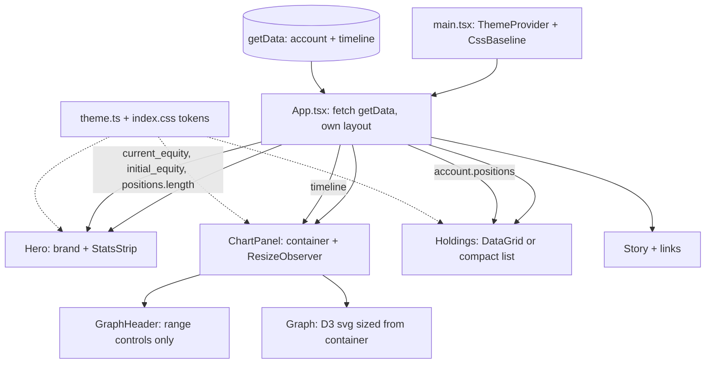
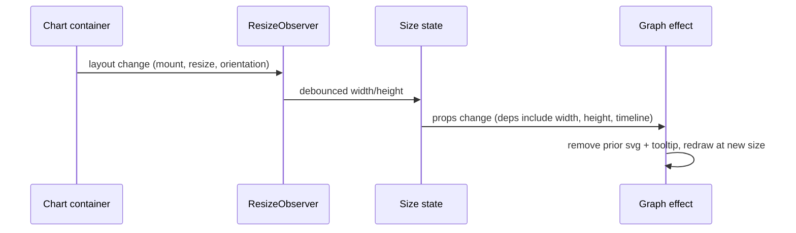

# Modern Mobile UI Redesign - Plan

## Goal Capsule

- **Objective:** Redesign the algosus live frontend into a performance-first, mobile-compatible portfolio showcase with intentional color, typography, and layout craft so recruiters and visitors experience a polished project page.
- **Product Authority:** User alignment (session 2026-07-27); Product Contract below.
- **Execution profile:** Smoke-first local verification (`npm run build` plus manual desktop and ~390px checks); no new automated test suite.
- **Stop conditions:** All units land, `npm run build` exits 0, and manual smoke passes on desktop and phone widths. Pause if responsive chart work requires replacing D3, or if stats cannot be derived from the existing `getData` payload.
- **Tail ownership:** Commit/push only if the user asks; Vercel auto-deploy stays disabled and production deploy is a separate user-approved step.
- **Open Blockers:** None.

---

## Product Contract

**Product Contract preservation:** Product Contract unchanged.

### Summary

Rebuild the single-page dashboard UI around a performance-first composition: equity headline and key stats lead, chart and holdings prove the bot, project story and outbound links support underneath. The page must work cleanly on phones, use a coherent visual system (color + type + spacing), and read as a crafted portfolio piece rather than a bare demo.

### Problem Frame

The live page still uses a side-by-side flex layout with large min-widths, one-shot measured D3 chart sizing, and almost no visual system (empty global CSS, no theme, default MUI look). On mobile the graph misaligns; overall it looks plain and weak next to similar portfolio projects. Dependencies were modernized in Phase 1; the UI surface was not.

### Key Decisions

- **Performance-first layout (Approach B) on desktop and mobile.** Equity headline and stats dominate; story and links sit below as supporting content. (session-settled: user-directed — chosen over stacked showcase (A) and editorial brand-hero (C): user wants B for both breakpoints)
- **Primary audience is recruiters / live-link visitors.** First-impression goal is a polished personal project, not an operator trading terminal.
- **Embellish within existing product surfaces.** Keep equity timeline (with range controls), holdings table, project blurb, and GitHub / LinkedIn / Portfolio links; add craft (stats strip, color system, typography, responsive layout) rather than new product features.
- **Agent-chosen craft package.** Include a small stats strip (equity, change since start or equivalent, position count), a coherent light visual system with intentional color (avoid generic AI-default purple/cream looks), expressive typography, and holdings presentation that fits small screens.
- **Frontend-only.** No trading logic, schedule, prompt, or backend API changes in this work.

### Actors

- A1. Recruiter / visitor — opens the live link on desktop or phone; judges craft and understands the project in seconds.
- A2. Project owner (Alan) — shares the link as portfolio evidence; does not need new trading controls on the page.

### Key Flows

- F1. First visit (desktop)
  - **Trigger:** Visitor loads the production page.
  - **Actors:** A1
  - **Steps:** Sees brand + equity headline/stats; scans chart and holdings; reads short project story; can open source / LinkedIn / portfolio links.
  - **Outcome:** Page reads as a polished performance-led portfolio piece.
  - **Covered by:** R1–R5, R9, R10

- F2. First visit (phone)
  - **Trigger:** Visitor loads the page on a narrow viewport.
  - **Actors:** A1
  - **Steps:** Same information order stacks vertically; chart fits the viewport without horizontal overflow or broken alignment; holdings remain readable; links remain usable.
  - **Outcome:** Mobile visit feels intentional, not a broken desktop layout.
  - **Covered by:** R5–R8, R10

- F3. Explore equity range
  - **Trigger:** Visitor uses existing range controls (1D / 1W / 1M / 1YR / ALL).
  - **Actors:** A1
  - **Steps:** Timeline filters as today; chart redraws within the responsive layout.
  - **Outcome:** Range exploration still works after redesign.
  - **Covered by:** R3, R11

### Layout shape (Approach B)

```mermaid
flowchart TB
  subgraph desktop [Desktop]
    S1[Brand + equity headline + stats]
    S2[Chart | Holdings]
    S3[Project story + links]
    S1 --> S2 --> S3
  end
  subgraph mobile [Mobile]
    M1[Brand + equity + stats]
    M2[Chart]
    M3[Holdings]
    M4[Story + links]
    M1 --> M2 --> M3 --> M4
  end
```

### Requirements

#### Composition and content

- R1. The page uses a performance-first information order: brand identity with equity headline and key stats first, then chart and holdings, then project story and outbound links.
- R2. Key stats include at least current equity, a performance delta (or equivalent change signal already derivable from timeline/account data), and current position count.
- R3. Preserve the equity timeline chart with existing range controls (1D, 1W, 1M, 1YR, ALL).
- R4. Preserve holdings display for symbol, price, shares, and profit (or clear successor columns with the same meaning).
- R5. Preserve a short educational project description and working links to GitHub, LinkedIn, and the personal portfolio site.

#### Mobile and responsive behavior

- R6. On typical phone widths, the layout stacks vertically without requiring horizontal scrolling of the page chrome.
- R7. The equity chart sizes fluidly to its container on resize and on initial load (no one-shot mount-only width that leaves the chart misaligned on mobile).
- R8. Holdings remain usable on narrow screens (readable columns or an equivalent compact presentation; no clipped-only desktop grid).

#### Visual craft

- R9. Introduce a coherent visual system: intentional color palette, typography hierarchy, and consistent spacing so the page no longer reads as unstyled default components.
- R10. Visual direction stays portfolio-crafted and light-theme by default; avoid generic purple-gradient and warm-cream-terracotta AI-default looks.
- R11. Loading and empty states (data still fetching, or no positions) look intentional rather than broken blank regions.

#### Constraints

- R12. Do not change trading schedules, OpenAI prompts, buy/sell logic, or paper-trading configuration.
- R13. Do not require authentication or add admin/trading control surfaces to the public page.
- R14. Success is verified with local frontend build (`npm run build`) and manual smoke of desktop + narrow mobile viewports; production deploy remains user-approved and separate.

### Acceptance Examples

- AE1. Narrow phone visit
  - **Covers:** R6, R7, R8
  - **Given:** A visitor opens the live (or local) page at ~390px width after redesign.
  - **When:** The page loads with account and timeline data.
  - **Then:** Content stacks in performance-first order; the chart fits the content width without sideways page scroll; holdings are readable.

- AE2. Recruiter desktop skim
  - **Covers:** R1, R2, R9
  - **Given:** A recruiter opens the page on a laptop.
  - **When:** They view the first screenful.
  - **Then:** Equity headline/stats and chart are immediately visible; color and type clearly signal intentional design rather than default MUI chrome alone.

- AE3. Range control still works
  - **Covers:** R3, R11
  - **Given:** Timeline data is loaded.
  - **When:** The visitor selects 1W then ALL.
  - **Then:** The chart updates for each range without layout collapse.

- AE4. Empty holdings
  - **Covers:** R8, R11
  - **Given:** Account has zero positions (e.g. after Friday sell).
  - **When:** The holdings section renders.
  - **Then:** The visitor sees a clear empty state, not a broken or oddly tall blank grid.

### Success Criteria

- A recruiter on phone can understand what the project is and that it has live performance data without fighting layout.
- The page no longer looks visually weak next to typical developer portfolio project pages (color, type, and spacing present intentional craft).
- Existing educational narrative and personal links remain findable.
- `npm run build` passes; no backend deploy required for this feature.

### Scope Boundaries

#### In scope

- Frontend layout, styling, theming, and responsive behavior for the existing single page
- Presentation polish for graph, stats, holdings, story, and links
- Chart sizing behavior required for responsive correctness

#### Deferred for later

- Env-based API URL (`VITE_API_URL`) and emulator DX
- Automated visual regression / CI
- Dark mode toggle
- Multi-page marketing site or blog

#### Outside this product's identity

- Live trading controls or switching off paper trading
- Auth-gated dashboards
- Replacing the educational bot narrative with a fintech product pitch

#### Deferred to follow-up work

- Typing the frontend data layer (today `account`/`timeline` are `any`); only add types where a unit needs them.
- Sharing `functions/src/models.ts` types with the frontend.
- Reordering `timeline` defensively by date — current push-order assumption is preserved.

### Dependencies / Assumptions

- Phase 1 dependency upgrades (React 19, MUI 6, TypeScript 5) are already in place on `main`.
- `getData` continues to supply `account` and `timeline` in the current shape; no new backend fields are required for v1 (stats derive from existing data).
- Theme mechanism, holdings strategy, and stats ownership are resolved in the Planning Contract (KTD2–KTD4); exact palette tokens remain an implementation choice within R9–R10.

### Outstanding Questions

#### Resolve Before Planning

- None.

#### Deferred to Planning

- Resolved in the Planning Contract below (theme mechanism, holdings strategy, stats ownership).

### Sources / Research

- Current layout constraints: `src/App.css` (flex wrap, min-width 400/450), `src/App.tsx` (card measure → Graph props), `src/Graph.tsx` (fixed SVG width/height), `src/Table.tsx` (`window.innerHeight * 0.7`), empty `src/index.css`, no ThemeProvider.
- Prior modernization explicitly deferred UI framework replacement: `docs/plans/2026-07-27-002-refactor-modernize-phase1-plan.md`.
- Visual probe (session): Approach B selected for desktop and mobile over stacked (A) and editorial (C).

---

## Planning Contract

### Key Technical Decisions

- KTD1. **Approach B composition on both breakpoints.** One component tree with responsive layout, not separate mobile/desktop trees. (session-settled: user-directed — chosen over stacked (A) and editorial (C): user wants performance-first everywhere; instantiates the Product Contract's Approach B decision)
- KTD1a. **One canonical breakpoint: MUI `md` (900px).** The chart/holdings column split (U2) and the holdings presentation switch (U5) both key off `theme.breakpoints` `md` so no viewport band gets a single-column layout with a desktop grid still inside it.
- KTD2. **MUI `ThemeProvider` plus CSS custom properties for tokens.** A theme in `src/theme.ts` wrapped at `src/main.tsx` owns MUI component styling; CSS variables in `src/index.css` expose the same palette to plain CSS and D3. (session-settled: user-approved — chosen over CSS-only restyling: D3 and MUI both need one palette source, and CSS-only leaves MUI defaults visible)
- KTD3. **Compact holdings list below `md`; DataGrid stays at `md` and above.** (session-settled: user-approved — chosen over DataGrid-everywhere with responsive columns: four fixed 120px columns plus grid chrome cannot fit ~390px without clipping)
- KTD4. **Stats strip owns equity and delta; `GraphHeader` slims to range controls.** Equity stops appearing twice, and the range-relative P/L chip gives way to a fixed since-start delta in the strip — a deliberate behavior change, so U3 checks parity against the old chips at the ALL range. (session-settled: user-approved — chosen over keeping chips in both places: the strip would otherwise repeat GraphHeader's equity)
- KTD5. **`ResizeObserver` on a dedicated chart container, with `width`/`height` added to the Graph effect deps.** Observer alone is insufficient — the current effect lists only `[timeline]`, so new size props would never trigger a redraw.
- KTD6. **Keep D3 and MUI.** No chart or grid library replacement; Phase 1 explicitly out-of-scoped that.
- KTD7. **Smoke verification only.** `npm run build` plus manual desktop/phone checks; no test runner is configured in the frontend package and adding one is out of scope.
- KTD8. **Scope the tooltip to the chart container.** The current tooltip appends to `body` with SVG-relative coordinates, which strands or mispositions it on resize and scroll.

### High-Level Technical Design

Component and data shape after the redesign:



Chart resize path, which is the main engineering risk:



Stats derive from the existing payload only:

| Stat | Source |
|---|---|
| Current equity | `account.current_equity`, fallback last `timeline` entry |
| Change since start | `current_equity - timeline[0].equity` (percent from that baseline; fall back to `initial_equity` when the timeline is empty) — matches what `GraphHeader` showed at the ALL range |
| Positions | `account.positions?.length ?? 0` |

### Assumptions

- `timeline` object-value order is chronological, as today's `GraphHeader` and `Graph` already assume.
- `account.initial_equity` is present for the delta; when missing, fall back to the first timeline entry.
- Fonts load from a CDN link in `index.html`; no font self-hosting pipeline is added.

### Sequencing

Tokens and theme first (U1), then layout shell (U2), then the pieces that live inside it (U3–U5), then the polish pass (U6). U4 is the riskiest unit and depends on the shell existing so the chart has a real container to measure.

---

## Implementation Units

### U1. Theme, tokens, and typography foundation

- **Goal:** Establish one palette, type scale, and spacing system available to both MUI components and plain CSS/D3.
- **Requirements:** R9, R10; KTD2
- **Dependencies:** none
- **Files:** `src/theme.ts` (new), `src/main.tsx`, `src/index.css`, `index.html`
- **Approach:** Create a light MUI theme (palette, typography, shape, component defaults) and wrap `<App />` with `ThemeProvider` + `CssBaseline` in `main.tsx`. Mirror the palette as CSS custom properties on `:root` in `index.css` so `Graph.tsx` can read chart colors from the same source. Add font links and fix the page `<title>` and description in `index.html`. Choose a deliberate, non-default palette (for example a deep ink neutral with a single saturated accent and distinct positive/negative colors); avoid purple gradients and cream/terracotta AI-default looks.
- **Patterns to follow:** Existing direct `@mui/material` imports; keep the CSS-file-per-component convention already used by `App.css`, `Graph.css`, `GraphHeader.css`.
- **Test scenarios:** Test expectation: none — pure styling/config with no behavioral change; verified by build plus visual smoke.
- **Verification:** `npm run build` passes; `npm run dev` shows the new fonts and palette applied globally with no unstyled flash of default MUI blue.

### U2. Approach B layout shell

- **Goal:** Restructure the page into performance-first sections that stack on mobile and split chart/holdings on desktop.
- **Requirements:** R1, R5, R6; F1, F2; KTD1
- **Dependencies:** U1
- **Files:** `src/App.tsx`, `src/App.css`
- **Approach:** Replace the two-child flex-wrap container with a responsive layout: hero (brand + stats slot), a chart/holdings region that is one column below `md` and two at `md` and above (KTD1a), then a story-and-links section extracted out of the graph Card. Remove `min-width: 400px` / `450px` and the `1.5vw` margins in favor of breakpoint-driven widths and consistent spacing. Keep the existing `getData` fetch and `originalTimeline`/`timeline` state exactly as is.

  Keep the mount-time `offsetWidth`/`offsetHeight` measurement working against the new chart container for now, re-pointed from the old Card ref. U4 replaces it with `ResizeObserver` — deleting it here would leave `Graph` receiving zero dimensions and ship a blank chart in any commit landed between U2 and U4.
- **Patterns to follow:** Existing fetch and state shape in `src/App.tsx`; MUI breakpoint conventions.
- **Test scenarios:**
  - Desktop at ~1280px renders hero, then chart beside holdings, then story and links, in that order.
  - Covers AE1. At ~390px the same sections stack vertically with no horizontal page scroll.
  - Story text and all three outbound links (GitHub, LinkedIn, Portfolio) remain present and clickable after being moved out of the graph Card.
- **Verification:** `npm run build` passes; manual check at 390px, 768px, and 1280px shows correct section order and no sideways scroll.

### U3. Stats strip

- **Goal:** Lead the page with equity, change since start, and position count derived from existing data.
- **Requirements:** R2, R11; F1; KTD4
- **Dependencies:** U1, U2
- **Files:** `src/StatsStrip.tsx` (new), `src/StatsStrip.css` (new), `src/App.tsx`
- **Approach:** Render three stats: current equity from `account.current_equity` (falling back to the last `timeline` entry), the delta against `timeline[0].equity` with percent (falling back to `initial_equity` when the timeline is empty), and `positions.length`. Use theme positive/negative colors for the delta. Show a skeleton or muted placeholder while `account` is empty so the first paint is not a blank band. On narrow screens the stats wrap or scale down rather than overflowing.
- **Patterns to follow:** Current profit/percent formatting in `src/GraphHeader.tsx` (`toFixed(2)`, signed prefix); reuse the same presentation so numbers read consistently.
- **Test scenarios:**
  - Covers AE2. With a populated account, equity, signed delta with percent, and position count all render in the first screenful with correct formatting.
  - Before data arrives (empty `account`), the strip shows placeholders rather than `$NaN` or a blank region.
  - With `positions` absent or empty, position count renders `0`.
  - Negative delta renders with the negative color and a leading minus.
- **Verification:** Values match what the old `GraphHeader` chips displayed for the ALL range; no `NaN` in any state.

### U4. Responsive chart sizing

- **Goal:** Make the D3 chart size to its own container and redraw correctly on resize and first load.
- **Requirements:** R3, R7; F2, F3; KTD5, KTD8
- **Dependencies:** U1, U2
- **Files:** `src/Graph.tsx`, `src/Graph.css`, `src/App.tsx`
- **Approach:** Give the chart a dedicated container with an explicit height (or aspect ratio) and observe it with `ResizeObserver`, replacing U2's interim mount-time measurement; store the measured size in state and pass it down, or measure inside `Graph` itself. Add `width` and `height` to the drawing effect's dependency array — today it is `[timeline]` only, so size changes would silently not redraw. Guard the effect against degenerate input (`width`, `height`, or `timeline.length` of zero) so the first pre-observer paint cannot produce `NaN` scales. Move the tooltip inside the chart container instead of appending it to `document.body`, per KTD8, and position it relative to that container. Debounce or `requestAnimationFrame`-throttle redraws. Reduce the fixed `margin = 100` and `translate(80, 50)` offsets on narrow widths so axes and labels fit. Read line colors from the CSS variables introduced in U1 instead of hardcoded `#4caf50` / `#ef5350`. Drop the first-render skip if it prevents an initial draw once sizing is container-driven.

  **Execution note:** Verify resize behavior in the browser before layering polish — this unit's failure mode is silent (chart draws once at the wrong size).

- **Technical design (directional):** Observe container → debounce → set size state → effect keyed on `[timeline, width, height]` → remove prior `#graph` svg and any live tooltip → rebuild scales and redraw.
- **Patterns to follow:** Existing D3 teardown (`d3.select('#graph').remove()`) and scale/axis construction in `src/Graph.tsx`.
- **Test scenarios:**
  - Covers AE1. At ~390px the SVG fits its container with axes visible and no clipped labels.
  - Covers AE3. Selecting 1W then ALL redraws the chart at the current container size without collapsing the layout.
  - Resizing the browser from desktop to phone width redraws the chart at the new width rather than leaving the old SVG.
  - Rotating or resizing while a tooltip is visible does not leave an orphaned tooltip on the page.
  - Rapid resize does not accumulate multiple stacked SVG elements in the container.
  - Before timeline data arrives, the chart container renders a fixed-aspect skeleton rather than collapsing to zero height.
- **Verification:** Manual resize sweep from ~1400px down to ~360px shows one correctly sized chart at every step; DOM contains exactly one `#graph` SVG.

### U5. Holdings for narrow screens

- **Goal:** Keep holdings readable on phones and give the zero-position case an intentional empty state.
- **Requirements:** R4, R8, R11; F1, F2; KTD3
- **Dependencies:** U1, U2
- **Files:** `src/Table.tsx`, `src/Table.css` (new), `src/App.tsx`
- **Approach:** Below the layout breakpoint, render a compact list or card per position (symbol and profit prominent; price and shares secondary); at or above it, keep `DataGrid` with flex columns instead of fixed 120px widths. Replace `window.innerHeight * 0.7` with a container-driven height so the section does not reserve a huge blank band on phones. Distinguish loading from empty: show muted placeholders until the first fetch settles, and reserve the explicit empty state for a resolved payload with no positions — expected after the Friday sell. `account` starts as `{}`, so keying the empty state on `positions.length` alone would flash "no holdings" during every load. Preserve the existing derived `profit` computation.
- **Patterns to follow:** Current column definitions and `getRowId={row => row.symbol}` in `src/Table.tsx`; keep the same four data points.
- **Test scenarios:**
  - Covers AE1. At ~390px, holdings render as the compact presentation with all four data points readable and no horizontal scroll.
  - Covers AE4. With zero positions, an explicit empty message renders instead of a tall blank grid.
  - At desktop width, `DataGrid` still renders symbol, price, shares, and profit, and columns fill available width.
  - Profit values match the existing `qty * (current_price - avg_entry_price)` calculation, including negatives.
  - While `account` is still loading, holdings show muted row placeholders rather than an empty region.
- **Verification:** Compare rendered values against the current production page for the same account payload; empty state visible when positions are cleared.

### U6. GraphHeader slim-down and craft pass

- **Goal:** Remove duplicated equity UI and finish the visual polish across sections.
- **Requirements:** R9, R10, R11; KTD4
- **Dependencies:** U3, U4, U5
- **Files:** `src/GraphHeader.tsx`, `src/GraphHeader.css`, `src/App.css`, `src/StatsStrip.css`
- **Approach:** Remove the equity and P/L chips from `GraphHeader` now that the stats strip owns them, keeping `setRange` and the range `ButtonGroup` intact; make the range control comfortable to tap on phones and give the active range a visible selected state (defaulting to ALL on load), which it lacks today. Then do a consistency pass on spacing, borders, elevation, and type scale so hero, chart, holdings, and story read as one system. Confirm loading states across sections look deliberate.
- **Patterns to follow:** Existing `setRange` logic in `src/GraphHeader.tsx` — do not change its filtering behavior or edge cases.
- **Test scenarios:**
  - Covers AE3. All five ranges (1D, 1W, 1M, 1YR, ALL) still filter the timeline exactly as before the chip removal.
  - Range buttons are tappable without zoom at ~390px, and the active range is visually distinguishable after each selection.
  - Equity appears once on the page (stats strip), not twice.
- **Verification:** Visual pass at 390px and 1280px; range switching behavior unchanged from current production.

---

## Verification Contract

| Gate | Command / check | Applies to |
|---|---|---|
| Type + build | `npm run build` | All units |
| Dev smoke | `npm run dev`, load `http://localhost:3000` | All units |
| Mobile smoke | DevTools device toolbar at ~390px: no horizontal page scroll, chart fits, holdings readable | U2, U4, U5 |
| Resize smoke | Drag window from ~1400px to ~360px: chart redraws, single SVG in DOM | U4 |
| Range smoke | Click 1D / 1W / 1M / 1YR / ALL | U4, U6 |
| Empty-state smoke | Render with zero positions | U5 |
| No backend drift | `functions/` untouched; `git status` shows only frontend files | All units |

Backend build and lint are not part of this feature; run them only if `functions/` was touched by mistake.

## Definition of Done

- All six units are implemented and their test scenarios verified manually.
- R1–R14 hold; AE1–AE4 pass on a real data payload.
- `npm run build` exits 0.
- Page order is hero/stats → chart + holdings → story + links on desktop, and the same order stacked on phone.
- Equity appears once; range controls still work; empty holdings shows an intentional state.
- No changes under `functions/`, no trading-config edits, no new dependencies beyond fonts.
- Production deploy is not performed as part of this work.
